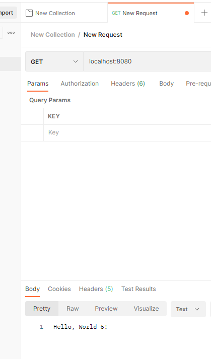

# Getting Started
## ch 1 springboot setup - Just setting up Springboot project
Introduces a simple get route.

Tutorials include:
- https://code.visualstudio.com/docs/languages/java#_install-visual-studio-code-for-java
- https://marketplace.visualstudio.com/items?itemName=vmware.vscode-boot-dev-pack
- https://marketplace.visualstudio.com/items?itemName=vscjava.vscode-gradle

### Reference Documentation
For further reference, please consider the following sections:

* [Official Gradle documentation](https://docs.gradle.org)
* [Spring Boot Gradle Plugin Reference Guide](https://docs.spring.io/spring-boot/docs/2.7.16/gradle-plugin/reference/html/)
* [Create an OCI image](https://docs.spring.io/spring-boot/docs/2.7.16/gradle-plugin/reference/html/#build-image)
* [Spring Web](https://docs.spring.io/spring-boot/docs/2.7.16/reference/htmlsingle/index.html#web)

### Guides
The following guides illustrate how to use some features concretely:

* [Building a RESTful Web Service](https://spring.io/guides/gs/rest-service/)
* [Serving Web Content with Spring MVC](https://spring.io/guides/gs/serving-web-content/)
* [Building REST services with Spring](https://spring.io/guides/tutorials/rest/)

### Additional Links
These additional references should also help you:

* [Gradle Build Scans – insights for your project's build](https://scans.gradle.com#gradle)

### Notes
Here is proof the GET route is working
